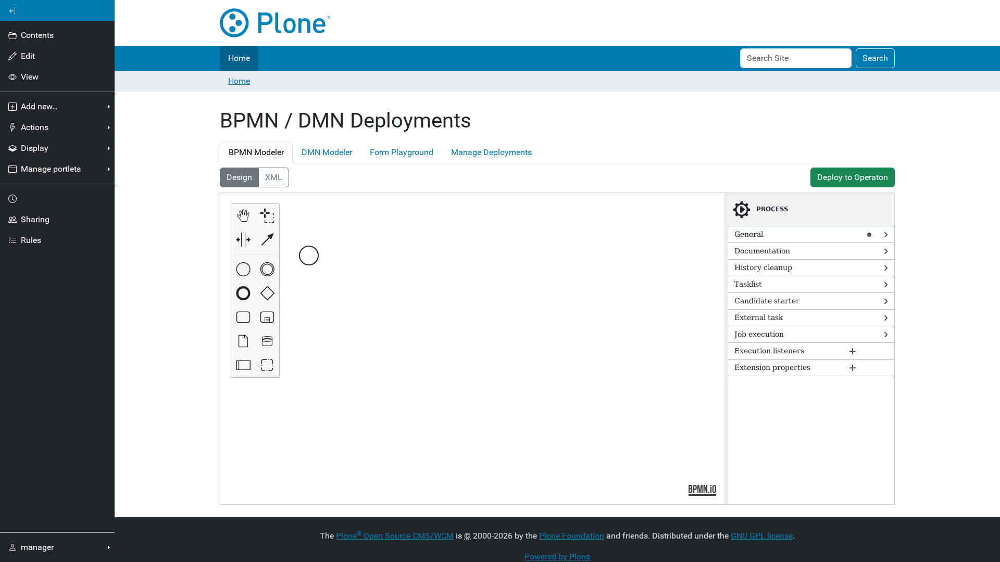
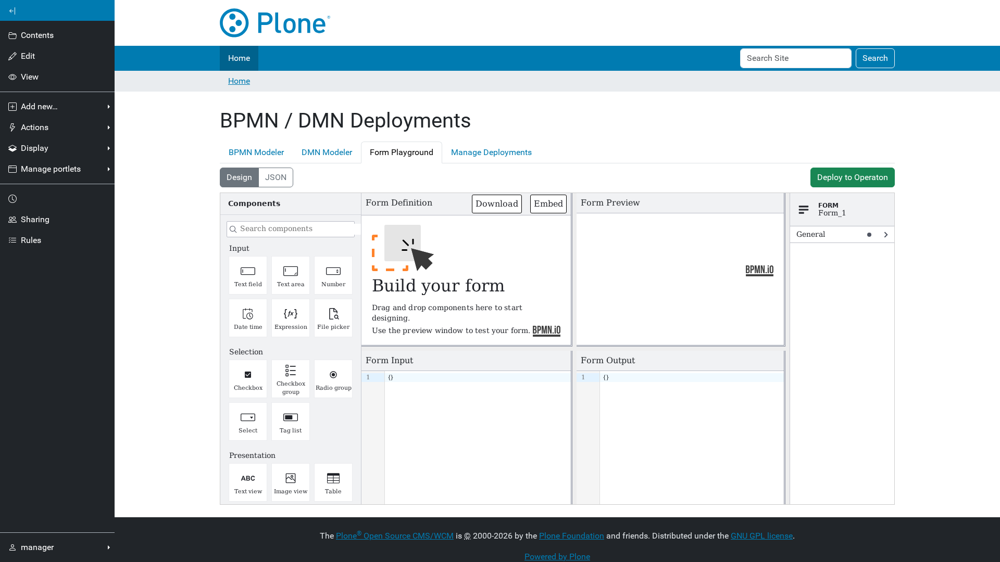
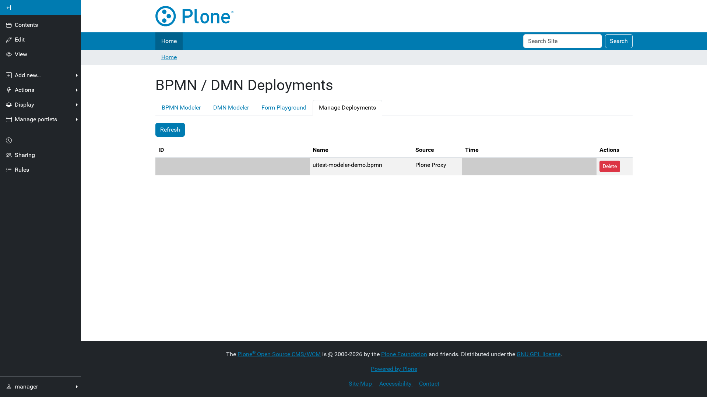

# Deploying processes

Site Setup → **BPMN/DMN Deployments** opens a modeler that deploys straight to
the engine, so a process can be drawn and published without leaving Plone.

The control panel requires `cmf.ManagePortal`, and the engine additionally
requires the user to be in `camunda-admin`. A Site Administrator who is not in
that group is refused.

## Draw a process

The BPMN tab is a full `bpmn-js` modeler with the Camunda properties panel.
Switch between **Design** and **XML** to paste an existing diagram.

Give the process a **history time to live** before deploying — the engine
refuses definitions without one. It is under *History cleanup* in the
properties panel when nothing is selected.

## Decision tables

The DMN tab edits decision tables that a BPMN business rule task can call
through its `decisionRef`.

## Forms

The Form tab is the Camunda form playground. A form deployed here can be
referenced from a start event or user task by its `formRef`, and Plone renders
it with the same `form-js` viewer Camunda uses.

## Deploy, list and delete

**Deploy to Operaton** uploads the current editor content. Deployments appear
on the **Manage Deployments** tab:

Deleting a deployment cascades into its running process instances, so a
deployment cannot be removed while leaving orphaned work behind.
