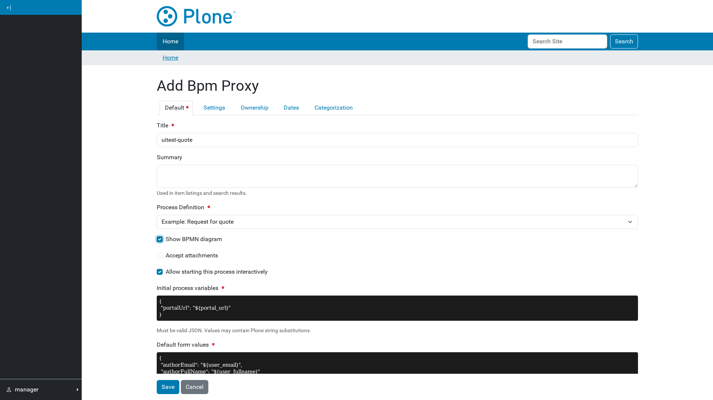
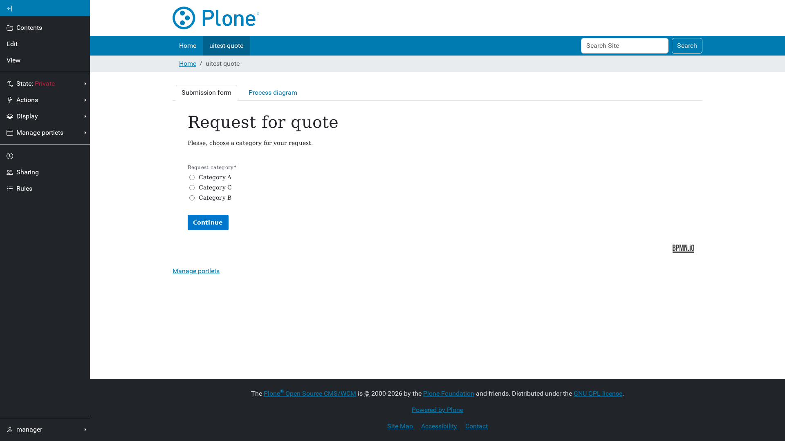
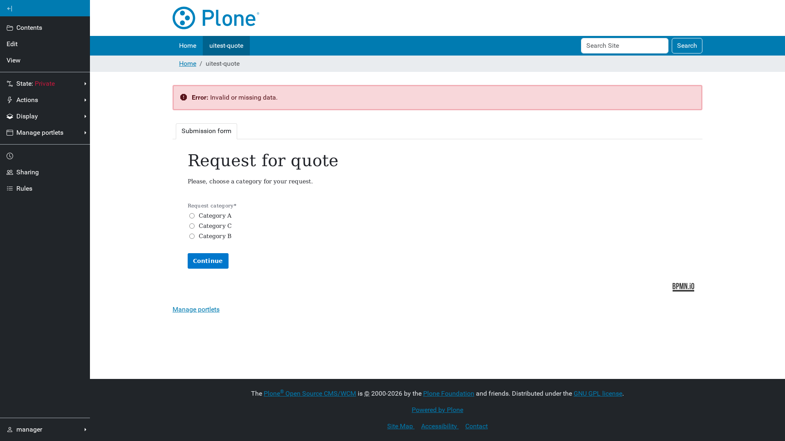
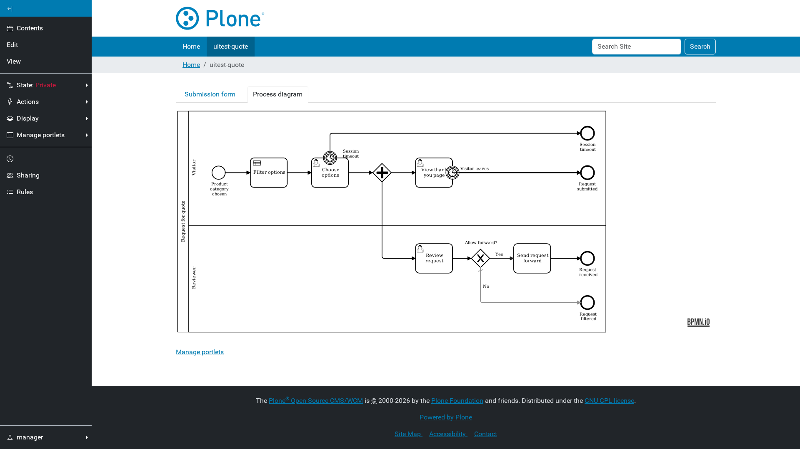

# Publishing a process as a page

A **Bpm Proxy** is a Plone page that shows a deployed process's start form.
Submitting it starts a process instance; the tasks that instance creates then
appear as sub-pages.

## Add the page

| Field | What it does |
| --- | --- |
| **Process Definition** | Picks a deployed process. The list shows only definitions this site's tenants may use. |
| **Show BPMN diagram** | Adds a *Process diagram* tab. |
| **Accept attachments** | Lets each task collect file uploads — see [Attachments](05-attachments.md). |
| **Initial process variables** | JSON sent when starting an instance. Default: `{"portalUrl": "${portal_url}"}`. |
| **Default form values** | JSON pre-filling the form. Default: `{"authorEmail": "${user_email}", "authorFullName": "${user_fullname}"}`. |

Both JSON fields accept Plone string substitutions — `${portal_url}`,
`${user_email}`, `${user_fullname}`, `${uuid}`, `${parent_uuid}`,
`${came_from}` — so a process can be handed its Plone context without the
diagram knowing anything about Plone.

## The start form

The form is the one deployed to the engine, rendered in Plone. Nothing about
it is configured in Plone: change the form in the modeler, redeploy, and the
page follows.

Submitting starts an instance whose business key is
`{page UUID}:{instance UUID}`. That binds the instance both to this page and to
its own attachment container, which is why one page can host many concurrent
instances.

## Validation

The form is validated again on the server — required fields, patterns,
minimum and maximum values and lengths, and vocabulary membership — so a
tampered-with submission is refused with *Invalid or missing data.* rather
than reaching the engine.

## The diagram

With **Show BPMN diagram** on, a *Process diagram* tab renders the deployed
BPMN and highlights the task being viewed. The diagram is drawn only once its
tab is actually visible, so switching tabs does not flash a half-drawn canvas.
