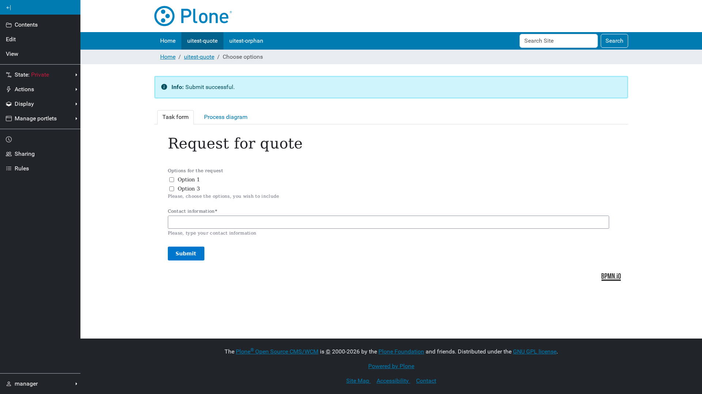

# Working with tasks

Every user task of a running instance is reachable as a sub-page of the page
that started it, at `@@bpm-task/{task id}`.

## A task form

The task form is the one the engine has for that task, pre-filled with the
instance's current variables. Submitting it completes the task and moves the
process on; Plone then redirects to the next task, or back to the page when
the process has nothing further for this user.

The breadcrumbs gain the task's name, so a user always knows which step of
which page they are on.

A task that does not belong to this page is refused with *Task not found or no
longer available.* — a task id cannot be used to reach work belonging
somewhere else.

## The task list

The *Task list* tab shows the open tasks of every instance started from this
page: name, description, who it is assigned to, and when it was created.
Anonymous participants show as *Anonymous User*.

For a task list that is not tied to one page, use the
[Task list portlet](06-portlets.md).
