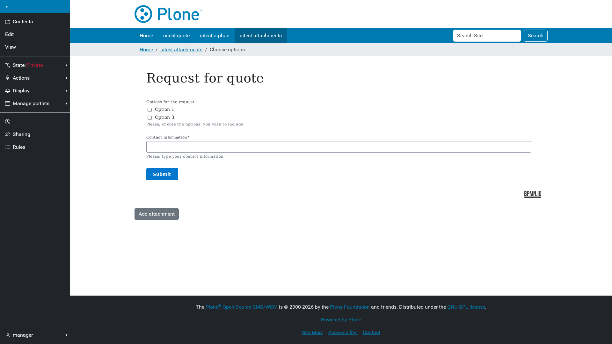
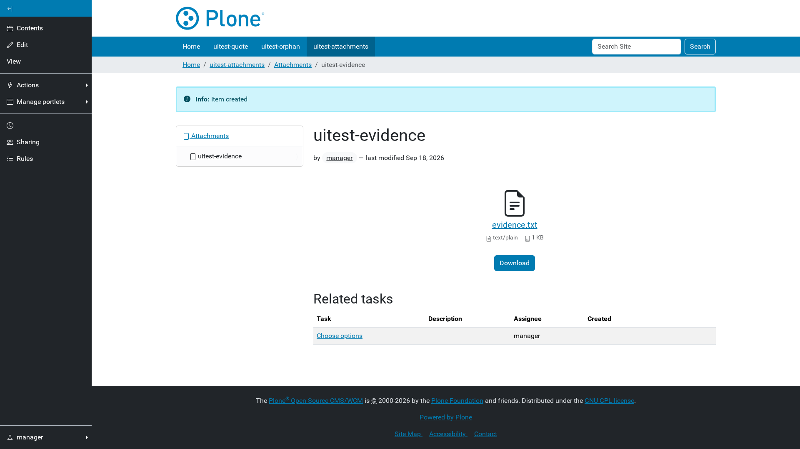

# Attachments

With **Accept attachments** switched on, each process instance gets its own
folder for files, and only people who currently have a task on that instance
can put files in it.

## Adding a file

**Add attachment** creates the instance's attachment folder the first time it
is used, then opens the ordinary Plone file add form. The folder is named
after the instance UUID and does not inherit local roles from its parent.

## What has been attached

The task page lists what has been attached so far, and each attachment page
lists the tasks it belongs to, so a reviewer can get from a file back to the
work item.

## Who may upload

Upload rights are computed live, not granted once: a user gets `Contributor`
and `Editor` on an attachment folder exactly while they have an open task
referencing it. When the task completes, the rights go away.

This means attachment permissions never need to be cleaned up, and a user
cannot keep access by bookmarking the folder.

Managers can list attachment folders whose process has ended at
`@@bpm-proxy-orphan-attachments`.
