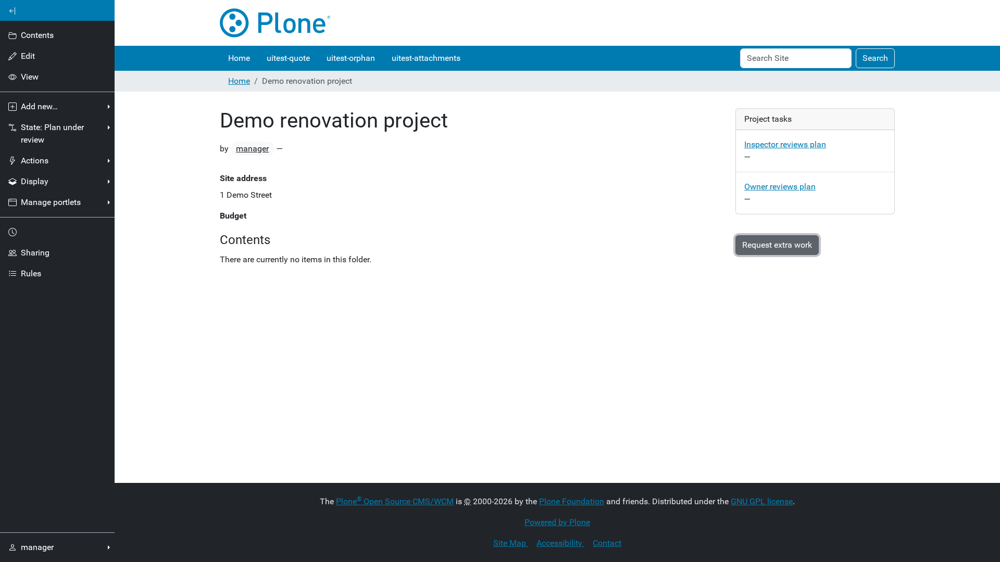

# Portlets

Three portlets surface process state anywhere in the site.

## Task list portlet

Lists pending tasks. Options:

- **Show only tasks for the current context** — only tasks belonging to the
  page the portlet is on.
- **Process definition** — restrict to one process.

With neither set it lists tasks across the whole site, capped at 25.

Task links go through `@@redirect-to-bpm-task/{task id}`, which resolves the
task's business key back to the Plone content that owns it. A link therefore
always lands on the right page, even when the person following it did not
start the process.

## Message dispatch portlet

Renders a button that delivers a named BPMN message with a JSON payload,
optionally correlated to a single process instance via a business key or
JSON correlation keys. Name, business key, correlation keys, and payload all
accept string substitutions, so `${uuid}` can target the message at the page
it is fired from.

This is how a page offers an action that has no Plone workflow transition
behind it: the button delivers the message, a process catches it, and the
work it creates comes back as tasks.

Unlike a signal (below), a message never broadcasts to every matching
instance — with real correlation keys it reaches exactly the one instance it
was meant for, even while other instances of the same process are running
concurrently elsewhere in the site. Leaving both business key and
correlation keys blank correlates engine-wide instead, and raises if more
than one instance matches.

## Signal dispatch portlet

Renders a button that throws a named BPMN signal with a JSON payload. Both
the name and the payload accept string substitutions, so `${uuid}` scopes a
signal to the page it is fired from.

A signal broadcasts: every process instance with a matching waiting catch
event reacts, with no way to target just one — prefer the message portlet
above whenever only one instance should react.

A signal nobody is subscribed to is a no-op, not an error.
