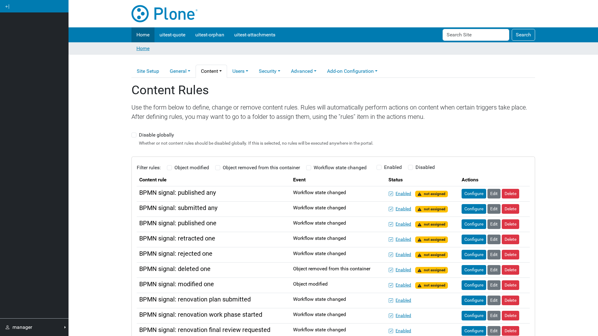

# Starting processes from Plone events

The add-on installs a content rule action, **Broadcast BPMN Signal**, and seven
ready-made rules that use it.

| Rule | Fires on | Signal |
| --- | --- | --- |
| Published any | publish, publish internally/externally | `plone-content-published` |
| Submitted any | submit | `plone-content-submitted` |
| Published one | publish | `plone-content-published:${uuid}` |
| Retracted one | retract | `plone-content-retracted:${uuid}` |
| Rejected one | reject | `plone-content-rejected:${uuid}` |
| Deleted one | object removed | `plone-content-deleted:${uuid}` |
| Modified one | object modified | `plone-content-modified:${uuid}` |

All seven send `{"uuid": "${uuid}", "portalUrl": "${portal_url}"}`.

## Using them

Go to the folder the rule should apply to, open **Rules** in the toolbar, and
assign one. A process that should react needs a matching signal start event —
for example a start event on `plone-content-published`.

The `…-one` variants put the content's UUID in the *signal name*. A running
process can therefore subscribe to events about one specific document, which
is what lets a process follow a piece of content through its life rather than
reacting to every publish in the site.

## Ordering and safety

Signals are dispatched when the Plone transaction commits, not when the rule
runs. If the request fails after the rule fired, no signal is sent — the
engine never learns about work that was rolled back.
